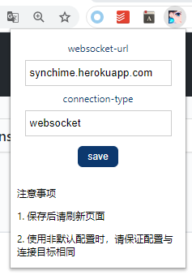
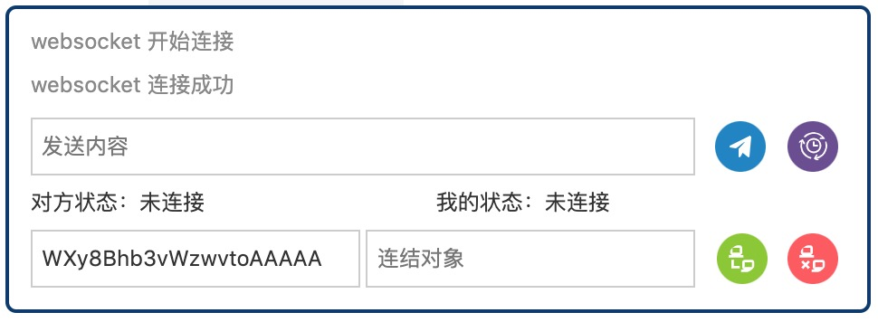

# syncHime

## 设置

[webstore 传送门](https://chrome.google.com/webstore/detail/synchime/emjmcfhchipmaflddbmkoojhecpfpjmo)

connection-type 可以选择 `webrtc` 或 `websocket`，默认 `webrtc`

- 选择 `webrtc` 时，使用 websocket 交换信息并建立连接后，直接 p2p 通讯
- 选择 `websocket` 时，建立连接后依然使用 websocket 通讯，适用于 p2p 通讯高延迟的情况

websocket-url 默认为 `synchime.herokuapp.com`，可以直接用，但是在延迟高时可以选择修改此配置

可以选择在自己的服务器部署 websocket 服务，也可以点一下按钮直接在 heroku 部署。

## 使用

- 绿色按钮：连接
- 红色按钮：断开
- 蓝色按钮：发送信息
- 紫色按钮：同步时间
- 双击对话框最小化

输入对方 ID 后点击连接即可

## TODO

- 样式优化
- i18n

## 参考链接

https://segmentfault.com/a/1190000020780854

https://www.html5rocks.com/en/tutorials/webrtc/basics/

https://www.html5rocks.com/en/tutorials/webrtc/infrastructure/